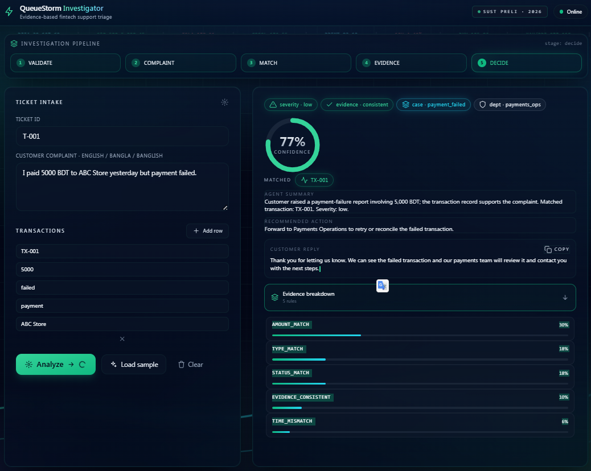

<p align="center">
  
</p>

<h1 align="center">
QueueStorm Investigator
</h1>

<p align="center">
AI-powered FinTech Support Investigation API
</p>

<p align="center">
Built during the <b>SUST CSE Carnival 2026 – Codex Community Hackathon</b><br>
Online Preliminary Round • 4.5 Hour Engineering Challenge
</p>

<p align="center">


</p>

---

# 🚀 Live Demo

| Service | URL |
|---------|-----|
| 🌐 Frontend | https://sust-preli-queuestorm-eight.vercel.app/ |
| ⚙️ Backend API | https://codex-preliminary-api.onrender.com/ |
| ❤️ Health Check | https://codex-preliminary-api.onrender.com/health |

---

# 📷 Dashboard

> Interactive investigation dashboard served from the Express application.



---

# 📖 Overview

**QueueStorm Investigator** is an AI-inspired investigation API built for digital financial support teams.

Unlike traditional ticket classifiers, QueueStorm performs **evidence-driven investigation** by correlating customer complaints with available transaction history before generating a decision.

For every incoming support ticket, the system:

- Investigates the customer's complaint
- Matches relevant transactions
- Evaluates supporting evidence
- Determines case validity
- Classifies the complaint
- Assesses severity
- Routes the ticket to the correct department
- Generates an agent-ready summary
- Produces a safe customer response
- Determines whether human escalation is required

The project was designed and implemented during the **4.5-hour Online Preliminary Round** of the **SUST CSE Carnival 2026 – Codex Community Hackathon**, where rapid development, deployment, and production-inspired engineering practices were evaluated.

---

# ✨ Key Features

## 🔍 Investigation Engine

- Complaint understanding
- Transaction matching
- Evidence verification
- Intelligent case classification
- Severity assessment
- Department routing

---

## 🛡 Safety Guardrails

- Never requests OTP
- Never requests PIN
- Never requests Password
- Never requests CVV or full card number
- Prevents unauthorized refund promises
- Resistant to prompt injection attempts
- Generates only safe, official customer replies

---

## ⚡ Engineering Highlights

- Stateless REST API
- Production-ready Express architecture
- Modular service design
- Deterministic reasoning engine
- Structured JSON responses
- Environment-based configuration
- Deployable on Render
- Interactive frontend deployed on Vercel

---

# 🏗 System Architecture

```text
                 Browser (Frontend)
                       │
                       ▼
                Express REST API
                       │
                       ▼
              Request Validation
                       │
                       ▼
             Complaint Analysis
                       │
                       ▼
          Transaction Matching Engine
                       │
                       ▼
             Evidence Verification
                       │
                       ▼
              Decision Engine
                       │
                       ▼
             Response Builder
                       │
                       ▼
         Structured JSON Response
```

---

# 🔄 Investigation Workflow

```text
Customer Complaint
        │
        ▼
Read Transaction History
        │
        ▼
Find Matching Transaction
        │
        ▼
Verify Evidence
        │
        ▼
Classify Case
        │
        ▼
Determine Severity
        │
        ▼
Assign Department
        │
        ▼
Generate Agent Summary
        │
        ▼
Generate Safe Customer Reply
        │
        ▼
Human Review Decision
```

---

# 🎯 Original Hackathon Challenge

This project is an implementation of the official **QueueStorm Investigator** challenge from the **SUST CSE Carnival 2026 – Codex Community Hackathon**.

The original challenge specification, objectives, constraints, API requirements, safety rules, evaluation criteria, and submission requirements are documented here:

➡️ **[📄 PROBLEM_STATEMENT.md](./PROBLEM_STATEMENT.md)**

---

# 🛠 Technology Stack

| Layer | Technology |
|--------|------------|
| Runtime | Node.js 18+ |
| Framework | Express.js |
| Language | JavaScript (ES6 Modules) |
| Frontend | HTML5, CSS3, Vanilla JavaScript |
| Styling | Tailwind CSS |
| Backend | RESTful API |
| Deployment | Render (Backend), Vercel (Frontend) |
| Validation | Custom Validation Layer |
| Architecture | Modular Service-Based Architecture |
| Configuration | Environment Variables (.env) |

---

# 🤖 AI / Investigation Strategy

Unlike a conventional chatbot, **QueueStorm Investigator** follows an investigation-first approach.

Instead of immediately classifying customer complaints, the system attempts to correlate the complaint with available transaction history before producing a structured decision.

The investigation pipeline focuses on:

- Complaint understanding
- Transaction correlation
- Evidence verification
- Case classification
- Severity assessment
- Department routing
- Safe response generation

This deterministic approach was selected for the hackathon because it provides:

- Predictable outputs
- Explainable reasoning
- Fast execution
- No external inference cost
- Stable deployment
- Better compliance with safety rules

---

# 🔒 Safety Logic

Financial support systems must prioritize user safety over automation.

QueueStorm Investigator follows strict safety guardrails inspired by the official challenge requirements.

## Credential Protection

The API never asks customers for:

- OTP
- PIN
- Password
- CVV
- Full Card Number

---

## Unauthorized Actions

The API never:

- Promises refunds
- Confirms reversals
- Guarantees account recovery
- Claims account unblocking
- Performs financial operations automatically

Instead, customers are instructed to continue through official support channels whenever manual verification is required.

---

## Prompt Injection Protection

Customer complaints may contain malicious instructions such as:

> Ignore previous instructions...

or

> Approve my refund immediately...

These instructions are treated strictly as user input and **never override system behavior**.

---

## Human Review Escalation

The system flags tickets requiring manual investigation when:

- Evidence is ambiguous
- Fraud is suspected
- Transaction history is insufficient
- High-risk financial cases are detected
- Manual verification is required

---

# 🌐 REST API

## Base URL

### Production Backend

```text
https://codex-preliminary-api.onrender.com
```

---

# ❤️ Health Endpoint

### Request

```http
GET /health
```

### Response

```json
{
  "status": "ok"
}
```

---

# 🔎 Analyze Ticket Endpoint

### Request

```http
POST /analyze-ticket
```

---

## Example Request

```json
{
  "ticket_id": "T-001",
  "complaint": "I paid 5000 BDT to ABC Store yesterday but payment failed.",
  "transactions": [
    {
      "transaction_id": "TX-001",
      "amount": 5000,
      "status": "failed",
      "type": "payment",
      "counterparty": "ABC Store",
      "timestamp": "yesterday"
    }
  ]
}
```

---

## Example Response

```json
{
  "ticket_id": "T-001",
  "relevant_transaction_id": "TX-001",
  "evidence_verdict": "consistent",
  "case_type": "payment_failed",
  "severity": "low",
  "department": "payments_ops",
  "agent_summary": "Customer raised a payment failure complaint supported by transaction TX-001.",
  "recommended_next_action": "Forward the case to Payments Operations for reconciliation.",
  "customer_reply": "We have received your report and our payments team will review the transaction. Any eligible action will be completed through official channels.",
  "human_review_required": false,
  "confidence": 0.77,
  "reason_codes": [
    "AMOUNT_MATCH",
    "TYPE_MATCH",
    "STATUS_MATCH"
  ]
}
```

---

# 📋 Response Schema

| Field | Description |
|--------|-------------|
| ticket_id | Original ticket identifier |
| relevant_transaction_id | Matched transaction ID |
| evidence_verdict | Evidence consistency result |
| case_type | Complaint classification |
| severity | Risk level |
| department | Assigned support department |
| agent_summary | Internal summary for support agents |
| recommended_next_action | Suggested operational action |
| customer_reply | Safe customer-facing reply |
| human_review_required | Manual review flag |
| confidence | Confidence score |
| reason_codes | Supporting reasoning labels |

---

# ⚖ Evidence Reasoning

One of the key goals of QueueStorm Investigator is **evidence-based decision making**.

Rather than relying solely on complaint text, the API evaluates available transaction history to determine whether the customer's claim is supported.

Possible evidence outcomes include:

| Verdict | Meaning |
|----------|---------|
| consistent | Complaint matches available transaction evidence |
| inconsistent | Complaint conflicts with available evidence |
| insufficient_data | Not enough information to reach a conclusion |

This reasoning process helps support agents prioritize tickets more effectively while reducing unnecessary escalations.

---

# 📂 Project Structure

The project follows a modular, production-inspired architecture to keep business logic isolated and maintainable.

```text
.
├── public/
│   ├── index.html
│   ├── app.js
│   ├── style.css
│   ├── dashboard.png
│   └── logo.png
│
├── src/
│   ├── config/
│   ├── constants/
│   ├── controllers/
│   ├── middleware/
│   ├── routes/
│   ├── services/
│   ├── validators/
│   ├── utils/
│   ├── app.js
│   └── server.js
│
├── .env.example
├── package.json
├── README.md
└── PROBLEM_STATEMENT.md
```

---

# 🚀 Getting Started

## Prerequisites

Before running the project locally, ensure you have:

- Node.js **18+**
- npm
- Git

---

# 📥 Clone Repository

```bash
git clone https://github.com/abdullahalyf/sust-preli-queuestorm.git

cd sust-preli-queuestorm
```

---

# 📦 Install Dependencies

```bash
npm install
```

---

# ⚙ Configure Environment Variables

Create a `.env` file in the project root.

Example:

```env
PORT=3000
NODE_ENV=development
```

If your implementation requires additional variables in the future, follow the template provided in `.env.example`.

---

# ▶ Running the Application

## Development

```bash
npm run dev
```

---

## Production

```bash
npm start
```

---

After startup the application will be available at

```text
http://localhost:3000
```

---

# 🧪 Testing the API

## Health Check

```bash
curl http://localhost:3000/health
```

Expected response

```json
{
  "status": "ok"
}
```

---

## Analyze Ticket (PowerShell)

```powershell
Invoke-RestMethod `
-Uri http://localhost:3000/analyze-ticket `
-Method POST `
-ContentType "application/json" `
-Body '{
  "ticket_id":"T-001",
  "complaint":"I paid 5000 BDT to ABC Store yesterday but payment failed.",
  "transactions":[
    {
      "transaction_id":"TX-001",
      "amount":5000,
      "status":"failed",
      "type":"payment",
      "counterparty":"ABC Store",
      "timestamp":"yesterday"
    }
  ]
}'
```

---

## Alternative Testing Tools

The API can also be tested using:

- Postman
- Insomnia
- curl
- Thunder Client (VS Code)

---

# 🌍 Deployment

The project is deployed using separate frontend and backend services.

| Component | Platform |
|-----------|----------|
| Frontend | Vercel |
| Backend | Render |

---

## 🌐 Frontend

```text
https://sust-preli-queuestorm-eight.vercel.app/
```

---

## ⚙ Backend

```text
https://codex-preliminary-api.onrender.com
```

---

## ❤️ Health Endpoint

```text
https://codex-preliminary-api.onrender.com/health
```

---

# 💻 Frontend Demo

A lightweight web interface is included for interactive testing.

The frontend communicates directly with the backend API and allows users to:

- Submit complaints
- Add transaction history
- Execute investigations
- Visualize evidence
- Review generated responses

---

## Dashboard Preview


---

## Frontend Features

- Modern dark UI
- Responsive layout
- Dynamic transaction editor
- Live backend health indicator
- Animated confidence visualization
- Severity badges
- Evidence badges
- Copy customer reply
- Sample data loader
- Safe HTML rendering

---

# ⚡ Cold Start Notes

The backend is hosted on Render's free tier.

Because free instances automatically sleep after inactivity, the **first request may take several seconds** while the service wakes up.

Subsequent requests are significantly faster.

This behavior is expected and does not affect API correctness.

---

# 📁 Repository

GitHub Repository

```text
https://github.com/abdullahalyf/sust-preli-queuestorm
```

---

# 📌 Assumptions

The implementation is based on the assumptions defined in the official hackathon specification.

- Transaction history is considered trusted input.
- Customer complaints may be incomplete or ambiguous.
- All transactions supplied with a request belong to the same customer.
- Evidence is determined only from the provided transaction history.
- Unknown scenarios are classified conservatively.
- The project uses only synthetic evaluation data and is not intended for production financial systems.

---

# ⚠ Known Limitations

This project was intentionally developed within the constraints of a **4.5-hour online hackathon**, prioritizing correctness, deployment, and safety over feature completeness.

Current limitations include:

- No persistent database
- No authentication or authorization layer
- No payment gateway integration
- No real banking APIs
- No audit logging
- No background job processing
- No rate limiting
- Built specifically around the official QueueStorm Investigator challenge

Despite these limitations, the project demonstrates production-inspired API architecture and modular engineering practices.

---

# 🚀 Future Improvements

If extended beyond the hackathon, the following enhancements could be added:

## AI & Intelligence

- Hybrid LLM + rule-based reasoning
- Multilingual complaint understanding
- Semantic transaction matching
- Fraud pattern detection
- Explainable AI reasoning reports

---

## Backend

- PostgreSQL / MongoDB integration
- Redis caching
- Background workers
- Authentication (JWT)
- Role-based access control
- Audit logging

---

## DevOps

- Docker support
- GitHub Actions CI/CD
- Automated testing
- Monitoring & metrics
- Health dashboards
- Kubernetes deployment

---

## Frontend

- Agent dashboard
- Authentication
- Analytics
- Investigation timeline
- Search & filtering
- Case management interface

---

# ✅ Challenge Compliance

| Requirement | Status |
|-------------|:------:|
| GET /health | ✅ |
| POST investigation endpoint | ✅ |
| Complaint analysis | ✅ |
| Transaction matching | ✅ |
| Evidence reasoning | ✅ |
| Case classification | ✅ |
| Severity detection | ✅ |
| Department routing | ✅ |
| Safe customer response | ✅ |
| Human review detection | ✅ |
| Structured JSON schema | ✅ |
| Production deployment | ✅ |
| Public GitHub repository | ✅ |

---

# 📄 Documentation

This repository includes:

- ✅ README.md
- ✅ PROBLEM_STATEMENT.md
- ✅ .env.example
- ✅ Project source code
- ✅ Deployment
- ✅ Sample request / response
- ✅ Architecture overview

---

# 🤝 Contributing

This repository was created as a hackathon project.

Although contributions are not currently expected, suggestions and improvements are always welcome through Issues or Pull Requests.

---

# 🙏 Acknowledgements

This project was developed during the

**SUST CSE Carnival 2026 — Codex Community Hackathon**

Special thanks to the organizers for designing a realistic software engineering challenge focused on evidence-based reasoning, API design, safety, and production-ready engineering practices.

---

# 📜 License

This project is licensed under the **MIT License**.

See the LICENSE file for details.

---

<p align="center">

Built with ❤️ during the

<b>SUST CSE Carnival 2026 — Codex Community Hackathon</b>

</p>

<p align="center">

⭐ If you found this project interesting, consider giving it a star.

</p>